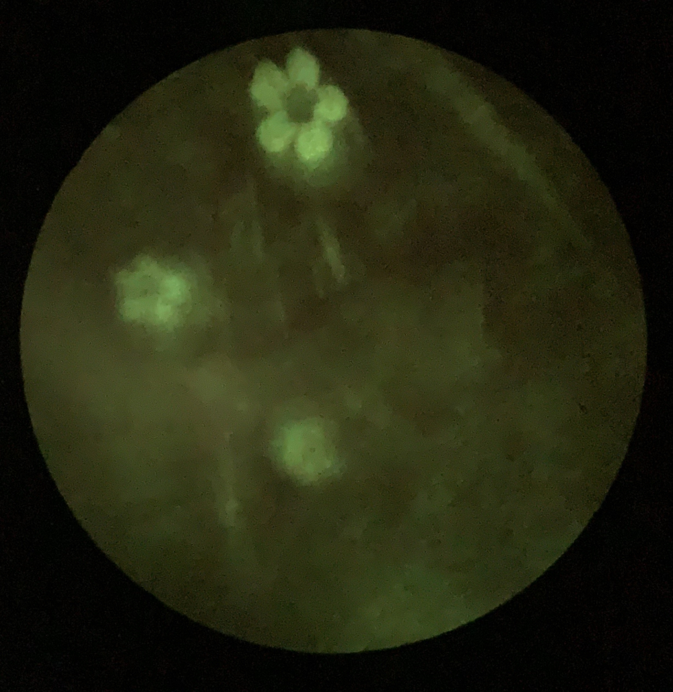
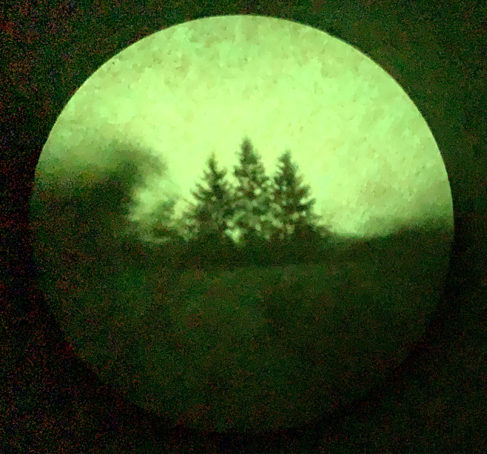
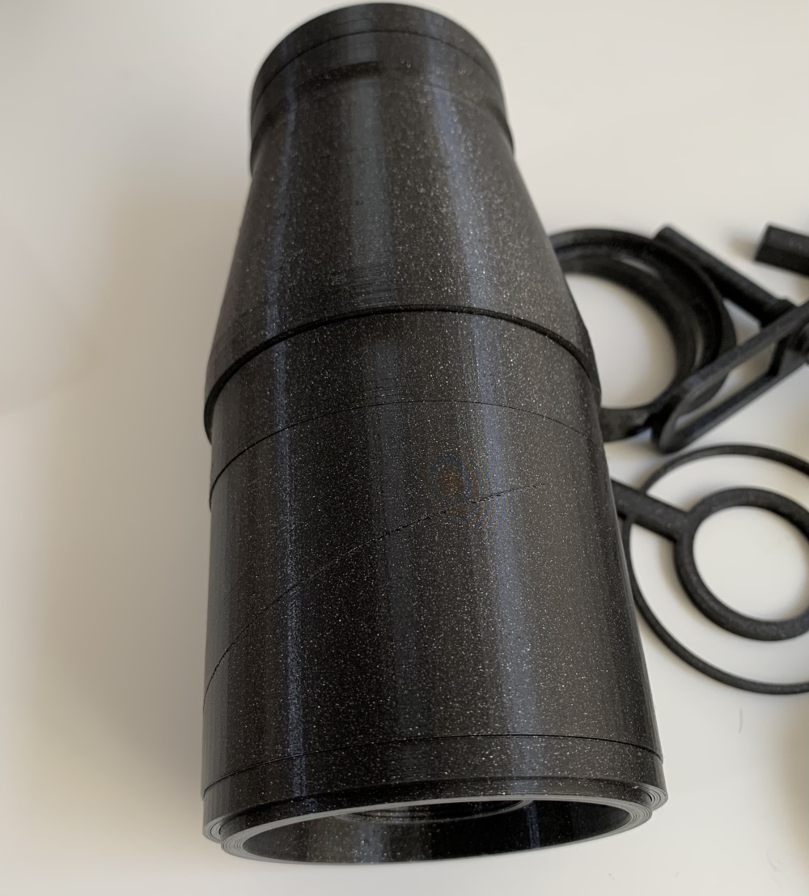
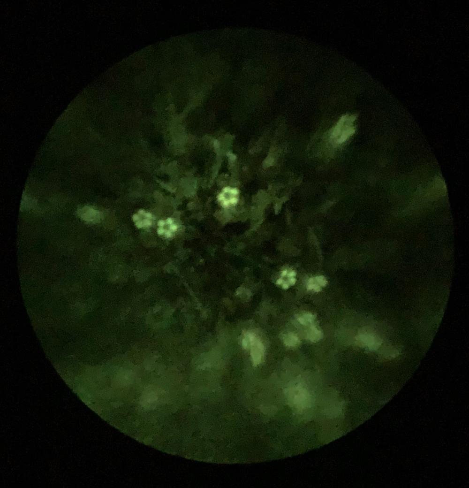
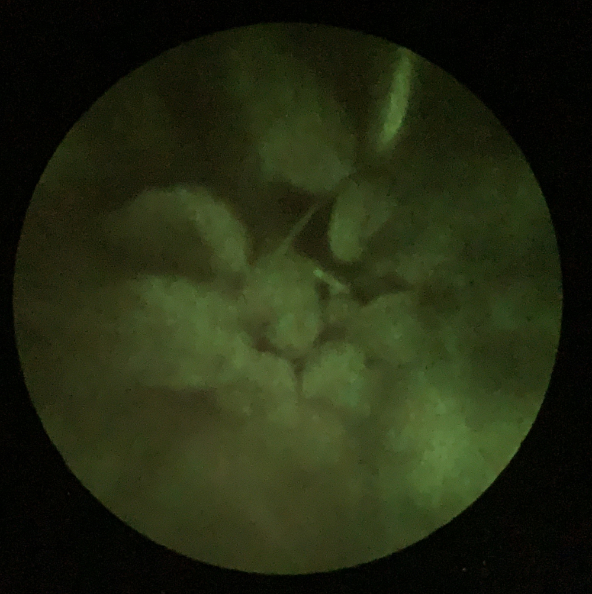
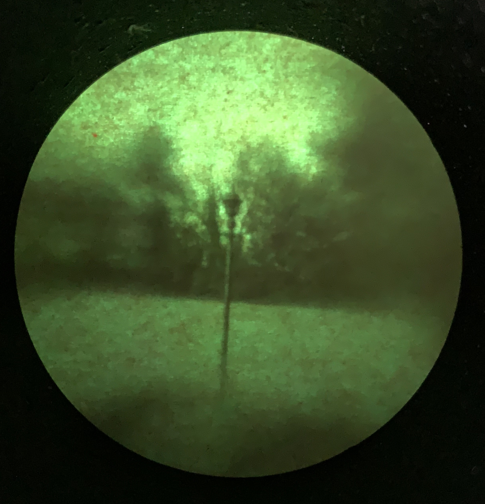
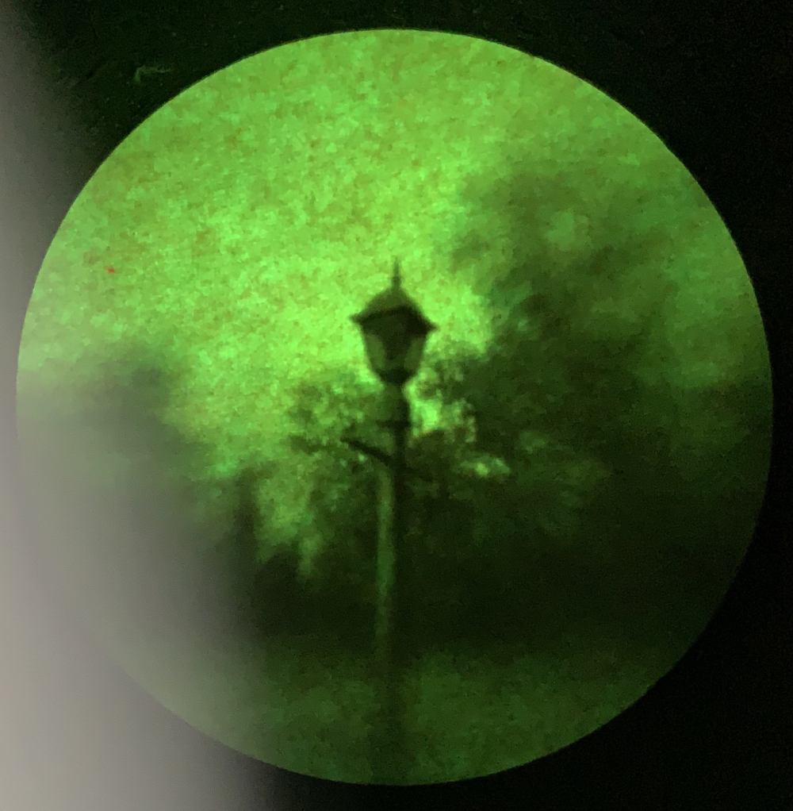
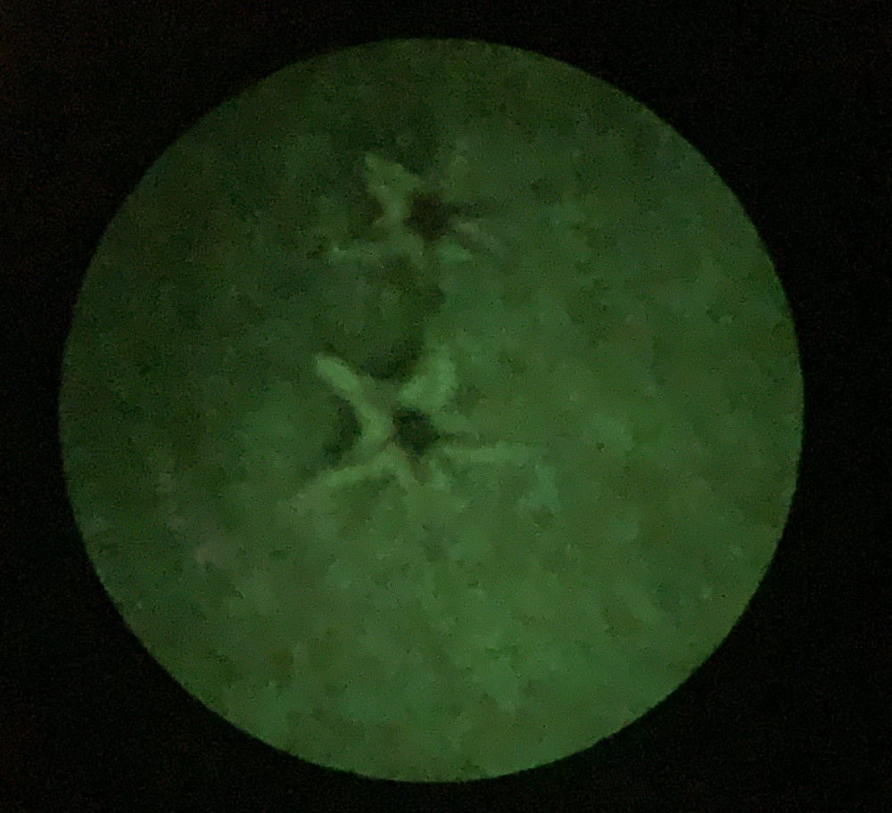

# Ultraviolet Light Viewer

This is a prototype device for viewing ultraviolet radiation.
It focuses ultraviolet light on a fluorescent screen which produces
an image in visible light that can be viewed directly by the human
eye without a camera. The ultimate intention is to use a fluorescent
screen containing a mixture of multiple different fluorescent agents
with different absorption and emission curves to produce a color image
where colors have a correspondence to ultraviolet wavelengths.

The initial proof of concept focused an image of a tape measure lit by an unfiltered 395 nm ultraviolet LED flashlight onto
a sheet of paper using an ordinary glass lens in a dark room. The left half is blue due to the fluorescence of optical brighteners added
to printer paper while the right half is green from fluorescent highlighter dye. (Due to the lack of filtering, longer wavelength flashlight emission and target fluorescence are also visible.)

The current prototype is now usable outdoors in sunlight as a light-sealed device with
an input filter to block visible light.

## Specifications

* Input wavelengths: 260-385 nm
* Output screens:
    * Fluorescent green: pyranine (substrates: paper, polycarbonate, glass)
    * Phosphorescent green: zinc sulfide (substrates: paper, polycarbonate)
    * Fluorescent blue, stilbene derivative (substrates: paper)
    * RGB 1: chlorophyll, riboflavin, and stilbene derivative (substrate: glass)
    * RGB 2: zinc sulfide with copper, silver, and manganese (substrate: polycarbonate)
* Screen size: 2.5" diameter circles up to 3 mm thick
* Focal length: 50 mm
* Focus range: 4 inches to infinity

## Components

The body is 3D-printed in PLA. The ultraviolet filter material is Schott UG11. Focusing uses a 1" diameter, 50 mm focal length fused silica lens which moves linearly inside a rotating barrel. A more complex optical design with additional elements including calcium fluoride may be considered in the future.

## Fluorescent Screen Notes

* Many fluorescent dyes found in highlighters are highly sensitive to pH and cannot be mixed to produce RGB screens.
* Chlorophyll exhibits red fluorescent emission but degrades too rapidly to be useful.
* Phosphorescent materials such as zinc sulfide can be useful when formulated to reduce their decay time.
* The optical brightener can be extracted from paper with ethanol. It is not appreciably soluble in acetone.

## Additional Photos

Note that all of these images are captured by a phone camera held to the eyepiece. A DSLR mount attachment is planned in the future.

