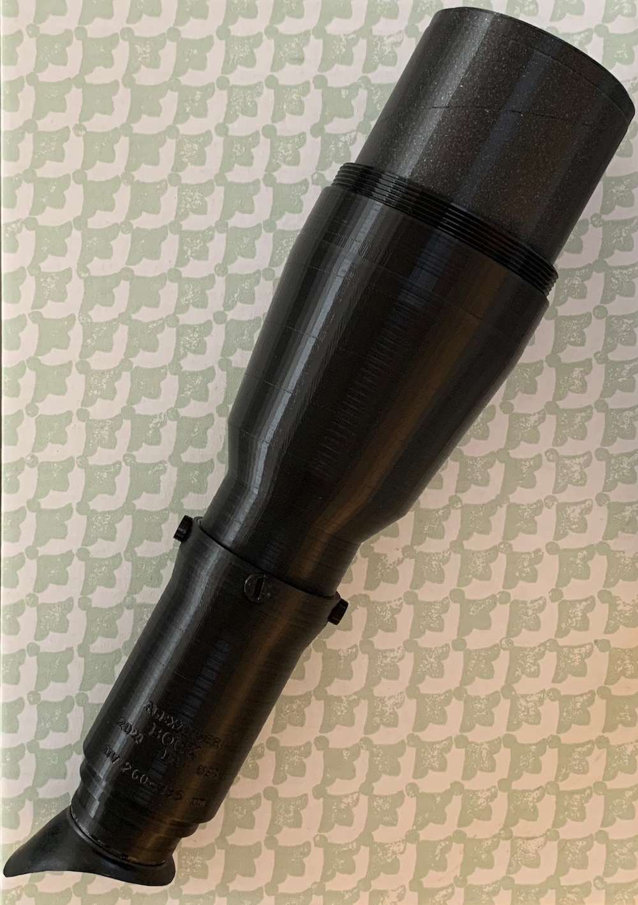

# Ultraviolet Light Viewer

This is a device for viewing ultraviolet radiation.
It focuses ultraviolet light on a fluorescent screen which produces
an image in visible light that can be viewed directly by the human
eye without a camera. A screen that provides a bright green image is simple to prepare.

The ultimate intention is to use a fluorescent
screen containing a mixture of multiple different fluorescent agents
with different absorption and emission curves to produce a color image
where colors have a correspondence to ultraviolet wavelengths.

The current version is usable outdoors in sunlight as a light-sealed device with an input filter to block visible light.

The image is bright enough to see outdoors, indoors near windows, in the vicinity of a blacklight, or near an ultraviolet flashlight.

STL files, OpenSCAD source files, and a full parts list will be added soon.

## Specifications

* Input wavelengths: 260-385 nm
* Output wavelengths: ~450-550 nm
* Fluorescent screen image circle: 62 mm
* Focal length: 50 mm
* Focus range: 4 inches to infinity
* Eyepiece: "Keplerian" inverting magnifier

## Components

The body is 3D-printed in PLA. The ultraviolet filter material is Schott UG11. Focusing uses a 1" diameter, 50 mm focal length fused silica lens which moves linearly inside a rotating barrel. A more complex optical design with additional elements including calcium fluoride may be considered in the future.

## History

The initial proof of concept focused an image of a tape measure lit by an unfiltered 395 nm ultraviolet LED flashlight onto
a sheet of paper using an ordinary glass lens in a dark room. The left half is blue due to the fluorescence of optical brighteners added
to printer paper while the right half is green from fluorescent highlighter dye. (Due to the lack of filtering at this stage, longer wavelength flashlight emission and target fluorescence are also visible.)

## Additional Photos

Note that all of these images are captured by a phone camera held to the eyepiece. A DSLR mount attachment is planned in the future.

